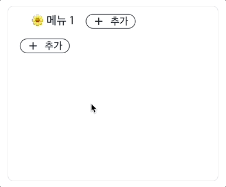
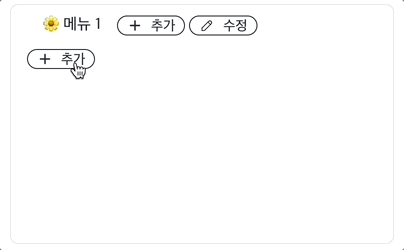

# 🌳 재귀함수를 활용한 트리메뉴 🌳

이 프로젝트는 트리메뉴 연습 예제입니다.

React, Typescript 그리고 Tailwindcss를 기반으로 개발 되었습니다.

## 프로젝트 설치 및 실행 방법

1. 저장소를 클론합니다.

```
git clone https://github.com/gandy818/tree-menu.git
```

2. 프로젝트 폴더로 이동합니다.

```
cd tree-menu
```

3. 필요한 의존성을 설치합니다.

```
npm install
```

4. 프로젝트를 실행합니다.

```
npm run dev
```

## 데모 영상

### 추가 재귀



### 수정 재귀



### 삭제 재귀


